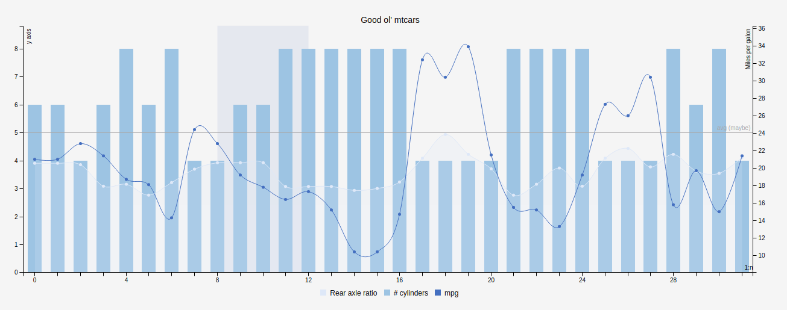
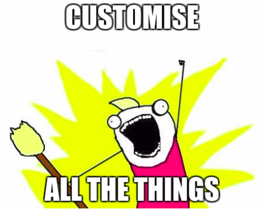

[](https://travis-ci.org/JohnCoene/billboard)

# billboard

[billboard.js](https://naver.github.io/billboard.js) for R.



#### Check the [Website](http://john-coene.com/htmlwidgets/billboard/)

* [Chart types](#chart-types)
* [Installation](#installation)
* [Examples](#examples)
* [Proxies](#proxies)
* [Functions](#functions)

## Installation

``` r
# install.packages("devtools")
devtools::install_github("JohnCoene/billboard")
```

## Chart types

* line
* spline
* bar
* scatter
* step
* area
* area step
* area spline
* pie
* donut
* gauge

## Examples

Includes but is not limited to:

```r
library(billboard)

mtcars %>% 
  b_board() %>%
  b_spline(wt) %>% 
  b_bar(disp, axis = "y2") %>% 
  b_step(cyl) %>% 
  b_area(qsec) %>% 
  b_scatter(hp, axis = "y2") %>% 
  b_xlabel("Miles per galon") %>% 
  b_color_brewer("Accent") %>% 
  b_tooltip(grouped = TRUE) %>% 
  b_grid_line(9, "Marked") %>% 
  b_grid_line(17, "avg (maybe)", axis = "y") %>% 
  b_region("x", 1, 4,)
```

## Proxies

Features Shiny proxies; functions ending in `_p`.

Proxies:

* `billboardProxy` - Create billboard proxy for Shiny
* `b_zoom_p` - Zoom proxy
* `b_focus_p` - Foxus proxy
* `b_defocus_p` - Unfocus proxy
* `b_transform_p` - Transform chart proxy
* `b_stack_p` - Stack proxy
* `b_region_p` - Customise regions proxy
* `b_add_region_p` - Add region proxy
* `b_flow_p` - Add rows 
* `b_load_p` - Add columns

**Basic Example**

See proxy documentation for more details `?b_flow_p`

#### [Demo](http://shiny.john-coene.com/billboard)

```r
libary(shiny)
library(billboard)

shinyApp(
  ui = fluidPage(
    selectInput(
      "transform",
      "Change chart type:",
      choices = c("line", "spline", "area", "area-spline", "scatter", "bar"),
      selected = "line"
    ),
    billboardOutput("b_board")
  ),
  server = function(input, output){
  
  data <- data.frame(y = runif(25, 1, 25))
  
    output$b_board <- renderBillboard({
      data %>% 
        b_board() %>% 
        b_line(y, name = "Values")
    })
    
    observeEvent(input$transform, {
      billboardProxy("b_board") %>% 
      b_transform_p(input$transform, "Values")
    })
  }
)
```

## Functions



* `b_area` - Add an area chart
* `b_area_spline` - Add an area spline chart
* `b_bar` - Add a bar chart
* `b_board` - Initialise
* `b_color` - customise colors
* `b_donut` - Add a donut chart
* `b_gauge` - Add a gauge chart
* `b_grid` - Customise the grid
* `b_grid_line` - Add a grid line
* `billboardOutput` - billboard output for Shiny
* `b_inter` - Customise interactivity
* `b_labels` - Add labels
* `b_legend` - Customise legend
* `b_line` - Add a line chart
* `b_color_magma` - Magma color palette
* `b_pad` - Adjust padding
* `b_pie` - Add a pie chart
* `b_color_plasma` - Plama color palette
* `b_region` - Add regions
* `b_resize` - Change auto resize
* `b_rotate` - Rotate chart
* `b_scatter` - Add a scatter plot
* `b_size` - Change svg size
* `b_spline` - Add a spline chart
* `b_step` - Add a step chart
* `b_step_area` - Add a step area chart
* `b_subchart` - Add a subchart
* `b_svg` - Customise svg
* `b_title` - Add a chart title
* `b_tooltip` - Customise tooltip
* `b_trans` - Customise transitions
* `b_color_brewer` - Use [RColorBrewer](https://cran.r-project.org/web/packages/RColorBrewer/index.html) palettes
* `b_color_viridis` - [Viridis](https://cran.r-project.org/web/packages/viridis/vignettes/intro-to-viridis.html) color palette
* `b_color_wes` - [Wes Anderson](https://github.com/karthik/wesanderson) color palettes
* `b_color_ghibli` - [Ghibli](https://github.com/ewenme/ghibli) palettes
* `b_xaxis` - Customise x axis
* `b_xgrid` - Customise x grid
* `b_xlabel` - Add x label
* `b_xtick` - Customise x ticks
* `b_yaxis` - Customise y axis
* `b_ygrid` - Customise y grid
* `b_ylabel` - Customise y label
* `b_ytick` - Customise y ticks
* `b_zoom` - Allow zoom
* `renderBillboard` - Render billboard for Shiny
* Proxies
  * `billboardProxy` - Create billboard proxy for SHiny
  * `b_zoom_p` - Zoom proxy
  * `b_focus_p` - Foxus proxy
  * `b_defocus_p` - Unfocus proxy
  * `b_transform_p` - Transform chart proxy
  * `b_stack_p` - Stack proxy
  * `b_region_p` - Customise regions proxy
  * `b_add_region_p` - Add region proxy
  * `b_flow_p` Add rows 
  * `b_load_p` Add columns
